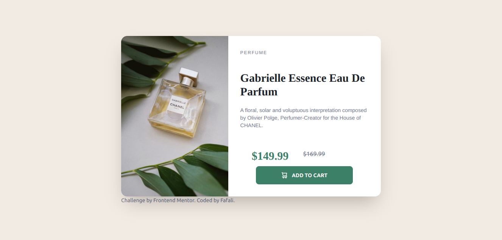
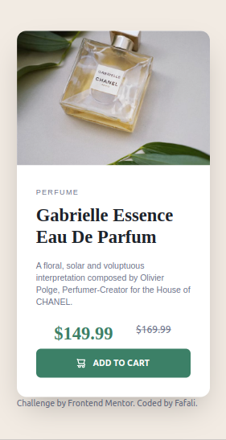

# Frontend Mentor - Product preview card component solution

This is a solution to the [Product preview card component challenge on Frontend Mentor](https://www.frontendmentor.io/challenges/product-preview-card-component-GO7UmttRfa). Frontend Mentor challenges help you improve your coding skills by building realistic projects. 

## Table of contents

- [Overview](#overview)
  - [The challenge](#the-challenge)
  - [Screenshot](#screenshot)
  - [Links](#links)
- [My process](#my-process)
  - [Built with](#built-with)
  - [What I learned](#what-i-learned)
  - [Continued development](#continued-development)
  - [Useful resources](#useful-resources)
- [Author](#author)
- [Acknowledgments](#acknowledgments)


## Overview

### The challenge

Users should be able to:

- View the optimal layout depending on their device's screen size
- See hover and focus states for interactive elements

### Screenshot





### Links

- Solution URL: [Add solution URL here](https://your-solution-url.com)
- Live Site URL: [Add live site URL here](https://your-live-site-url.com)

## My process

### Built with

- HTML
- Tailwind CSS
- Daisy UI
- Flexbox
- CSS
- Mobile-first workflow


### What I learned

Building this project was fun.

I learnt how to use flex... a bit and I got the chance to practice with tailwind css and daisy ui.

When I was reading the tailwind css documentation, it spoke about mobile-first breakpoint which honestly made my journey easier.

Got to learn some cool script...nothing fancy just npm script haha

Researching was a bit stressful since there were a lot of resourses and possible solutions available.

Got to think...a lot..haha about the layouts and design training the eye to see code within the designs.

For me the difficulty came when i had to switch images during certain breakpoints
And I need to learn how to write neater code..haha
```html
 <figure >
      
      
    </figure>
```

### Continued development
In the future, 
- I'd like to add more functionality as a database for the user purchase
- Neater and nicer UI for more attraction
- And even add more options as in a backend to support it

### Useful resources

- [Daisy UI](https://daisyui.com) - This is a cool resource. Helped me with most of the components and responsive designs

- [caniuse](https://caniuse.com) - I think most people are familiar with this. Helped checked compatability

- [rubber_ducky] - Yep rubber ducky helped me find some sneaky bugs

- [ducduckgo] - Awesome search engine. Most of my questions were answered

## Author

- Website - [Add your name here](https://www.your-site.com)
- Frontend Mentor - [@yourusername](https://www.frontendmentor.io/profile/yourusername)


## Acknowledgments
No one specific here.

Thanks to frontend mentor... really helpful

I'd like to thank all the helpful comments i found on the internet and all the cool articles i found

And to everyone else thanks for viewing my code ... i know it's not the prettiest but i'm learning
